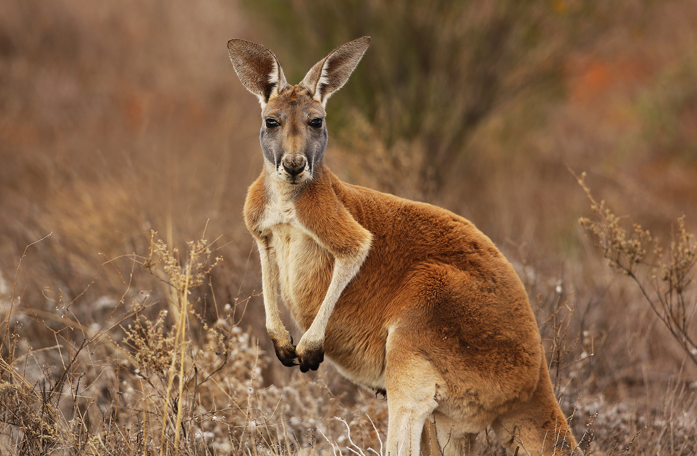

# Kangaroo Facts

Kangaroos are members of the zoological family macropodidae or "macropods". The word macropod is derived from Ancient Greek language meaning "long foot". 
The family also includes the wallaby and the wallaroo, but the term "kangaroo" generally refers to three species of large Australian macropods within the genus macropus, the red kangaroo, and the Eastern and Western grey kangaroos.
Kangaroos live in groups of 5 to 40 individuals called "mobs". They can be found throughout much of Australia, particularly the arid interior grasslands commonly called the "outback".
The most stunning distinguishing feature of the kangaroo is the overall skeletal uniqueness of these animals.
They are bi-pedal animals but they can't walk. The hind legs are designed to move together, and the kangaroo gets from place to place by hopping or bouncing. It is unclear how this form of locomotion evolved, but it is highly successful and efficient, taking kangaroos on long journeys as they search for grass and water in a dry and difficult habitat.
Along with its spectacular form of motion, the female kangaroo has a very large forward facing pouch where its young eat, sleep and live for the first six to eight months of life.
The baby kangaroo, called a joey, can be remarkably large by the time it stops using the pouch, and can be seen diving in head first, feet, ears or tail dangling out while it nurses or naps.
The kangaroo is native only to Australia, and is used, along with the large flightless bird called the emu, on the Australian coat of arms.
Kangaroos are not endangered and have healthy populations throughout their range. The kangaroo is hunted in Australia in harvests similar to deer hunting season in other countries, but the practice is under heavy scrutiny and criticism by some groups.
Kangaroo meat and fur are a natural part of the culture of many Australians.
Kangaroos are herbivores that spend the cooler parts of the day foraging for grasses and numerous species of plants. The midday finds mobs of kangaroos seeking refuge from the sun, often digging out shallow napping holes in the clay to beat the heat.
Kangaroos are well adapted to life in arid conditions and have similar physical adaptions to animals like the camel. They can regulate their blood chemistry to adapt in times of drought, and will even become infertile for entire seasons if the body is depleted of water. Because of this adaption, kangaroo populations in the wild vary greatly depending upon the amount of rainfall in past years.
Kangaroos have good vision and excellent hearing, and when a member of the "mob" spots danger they will warn the others by thumping the ground with their huge feet. They have a superior sense of smell as well, detecting watering holes from miles away.
In the outback, where water is scarce, groups of up to 1,000 kangaroos may converge on a watering source at one time.
The kangaroo is a large animal with some adult males reaching over 6 feet tall and weighing 200 pounds, but dingos can still pose a threat, and kangaroos, amazingly, have been observed making a getaway by diving in a river or lake and swimming to safety.
The hind legs, which don't move independently on land, move separately when swimming! 
# What Is The Difference Between Red Kangaroos And Grey Kangaroos?
The most recognizable kangaroos are also the largest, most populous and least endangered.
The red kangaroo is the largest marsupial on Earth. Males can be enormous at over 6 feet tall and 200 pounds. These are muscular and robust animals that can move at speeds of over 35 miles an hour, gobbling up land with 25 foot leaps. Red kangaroos are not always red, however. Males tend to have rusty colored fur, even when immature, and females are usually blue- grey or brown in color, but there are grey males and red females as well.
So the red kangaroo can't be distinguished by fur color alone. Red kangaroos have narrow eyes and distinctive white or pale colored stripes down their cheeks, and black dashes at the corners of the mouth.
The Eastern and Western grey kangaroos look very similar and were once considered the same species. They are generally not as tall as the red kangaroo but still quite large, and Eastern grey males can actually weigh more than red males.
The Western grey has the distinction of being known as "the "stinker". They have a strong odor caused by the types of plants they eat.

